# Quantum Duels RPSLS

Welcome to Quantum Duels, a modern take on the classic Rock, Paper, Scissors game with a quantum twist!

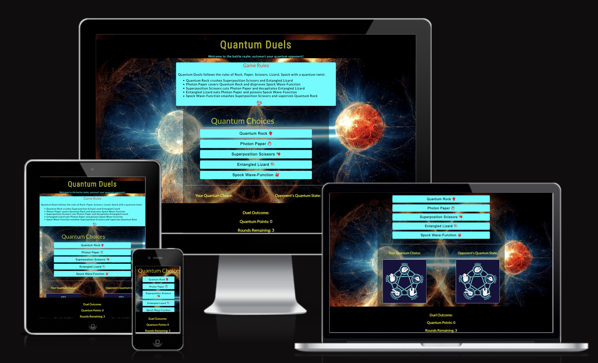

## Purpose

The goal of the site is to provide the user with an interactive classic online game that has elements of chance. Quantum Duels follows the rules of Rock, Paper, Scissors, Lizard, Spock but with a quantum twist! Which provides a challenging game with increasing level of difficulty for the user to test their skills and strategies against a quantum opponent (computer).

## UX Design

### User stories

**As a user**

- I want to easily understand the rules of the game.
- I am interested in knowing my scores and rounds I have left.
- I want to be able to easily interact with the game choices when I click on the choices available.
- I want to be able to see my score and progress during the gameplay.
- I want to be able to play the game again when I run out of rounds and the game ends.

**All users want to be able to access, interact and comfortably view the game on mobile devices**

## Features

### Pattern matching functionality

- The game has been scripted to create dynamic and responsive gameplay experiences that adapt to user actions for example button clicks, enhancing the users engagement and immersion by making the game feel more interactive and reactive. 

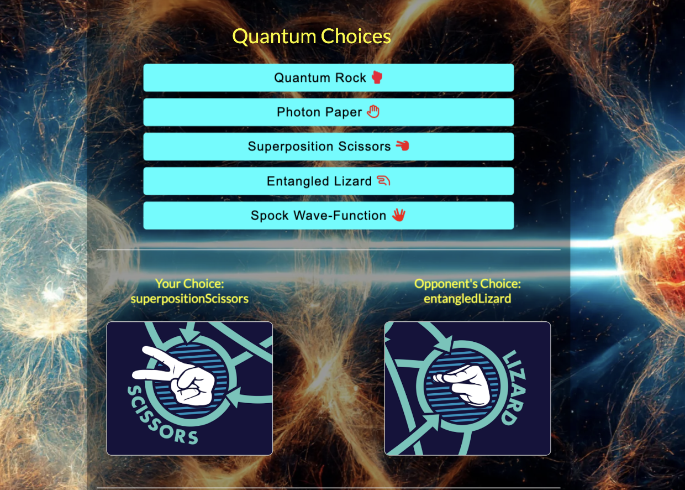

### A limited number of tries before the game is over

- The user is given three rounds of tries before the game is over and the user can keep track of his performance and the number of tries remaining whenever they are defeated by the computer (quantum opponent).

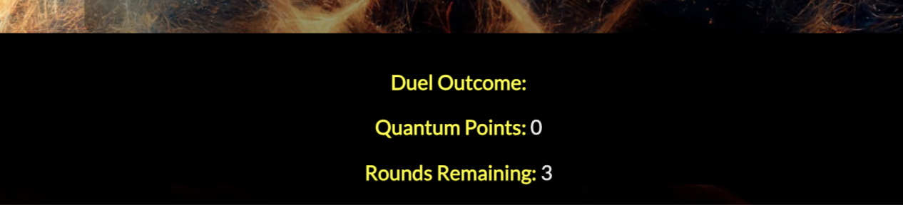

### A score tracking system

- The game is programmed for the user to keep track of his progress whenever they prevail against the computer(quantum opponent) and also after they run out of tries they are alerted of their score before they choose to try again.

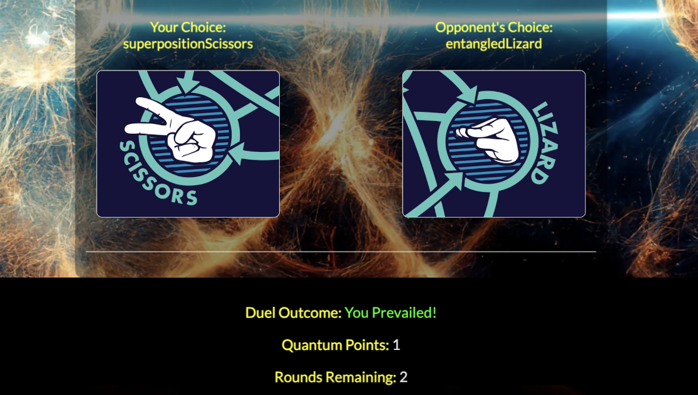

### The ability to play against the computer

- The game has been programmed for versus computer only (quantum opponent), which uses prediction to make a counter move against the user choices (quantum choices).

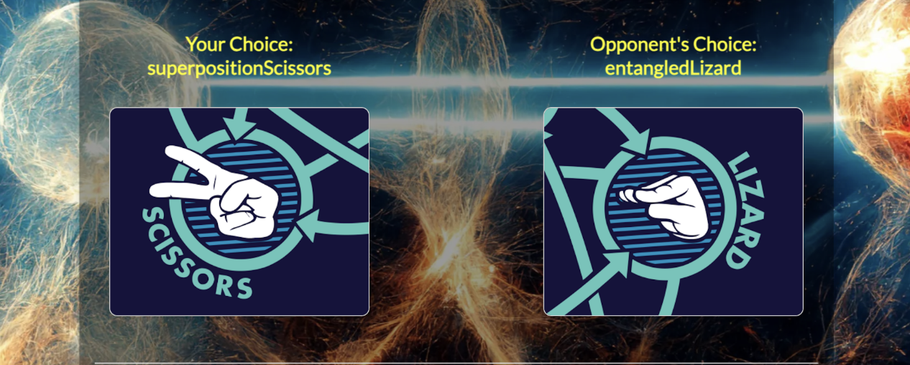

### Curtain raiser

- A fade-in-out curtain raiser before the page loads to enhance the user experience and make the loading process more engaging.

## Wireframe for project

Balsamiq was used to create the wireframes during the design process.

- Desktop view 
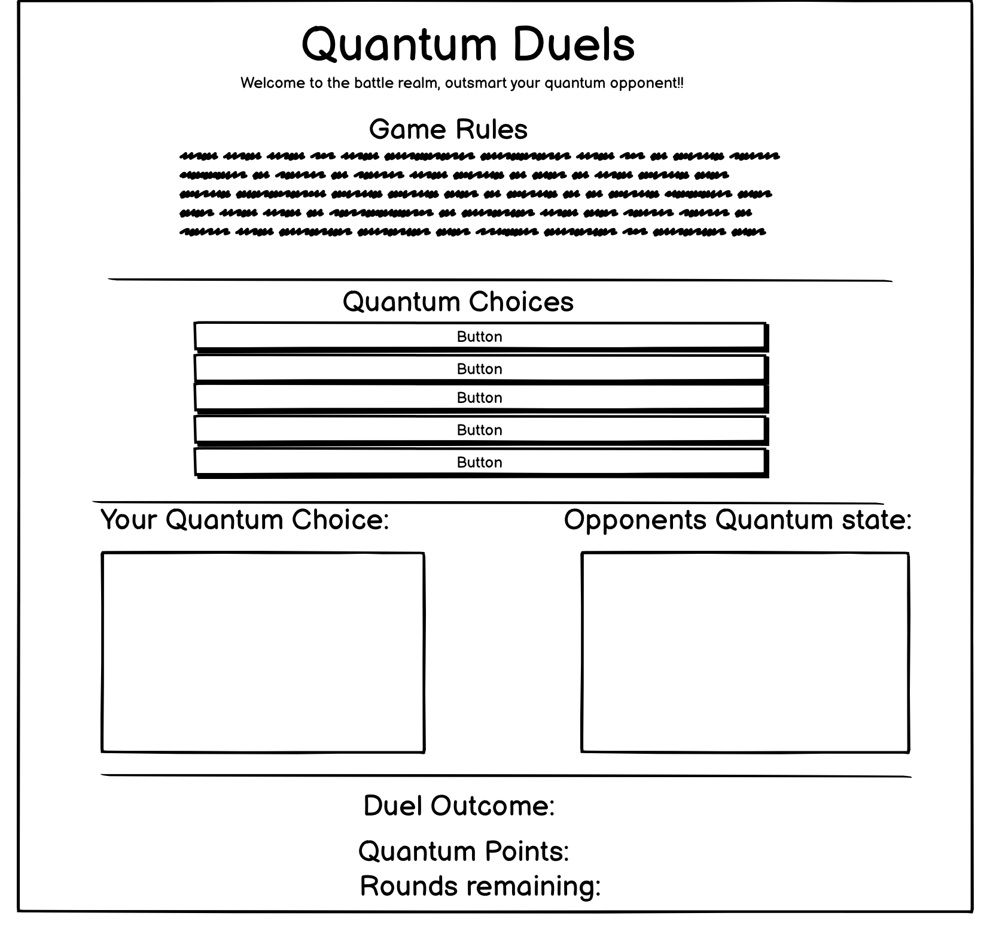

- ipad view 
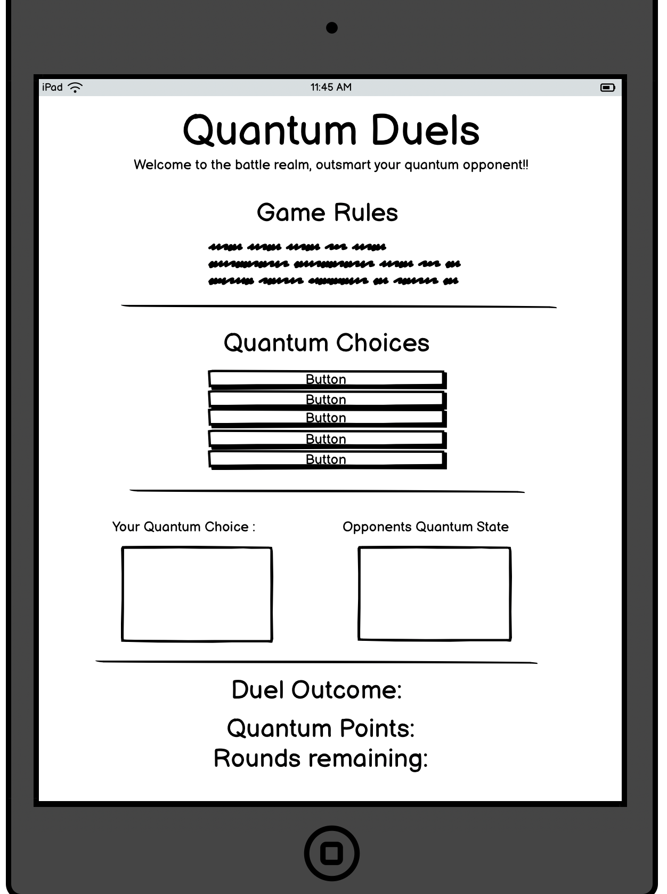

- Smart phones view
  
  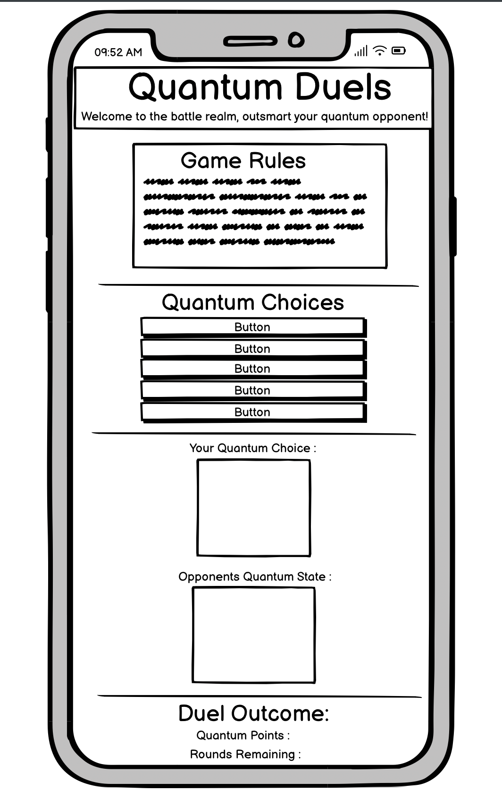

## Features Left to Implement

### Add sound effects

- For each button (quantum choices) when clicked on. This will bring some liveliness to the game.

### Implement a multiplayer mode for online battles

- This will enable the game to be more interactive and fun for users to be able to play with other users and not only against the quantum opponent (computer).

### Leaderboard system

- To rank players based on their performance (score). This will make the game more competitive and interesting for the user as they'll be able to track their progress and achievements.

## Technologies used

- HTML
- CSS
- JAVASCRIPT
- GITHUB
- CODEANYWHERE

### Validator Testing

- HTML
- Errors found when passed my code through the validator, were in the header element, some links weren't properly placed, also the script closing tag was also missing, by placing the appropriate tags and links to my favicon and style.css the errors were fixed. All buttons when clicked reacted and worked as expected, No errors were returned when passed the code again through the official [W3C validator](https://validator.w3.org/).
  
  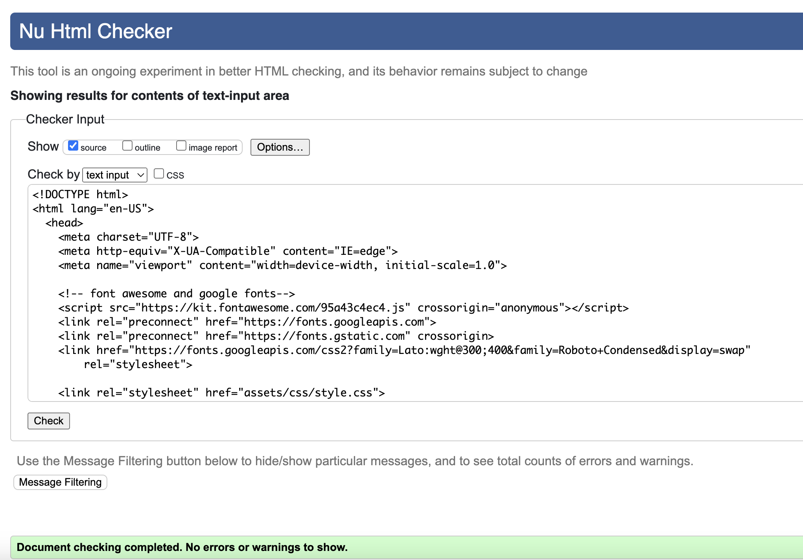
  
- CSS:
- Passing the code through the jigsaw validator, I realised that I did not place closing semicolons to most of the style for some ids and classed, by placing the colons and passing the code through the validator No errors were returned. 
  
  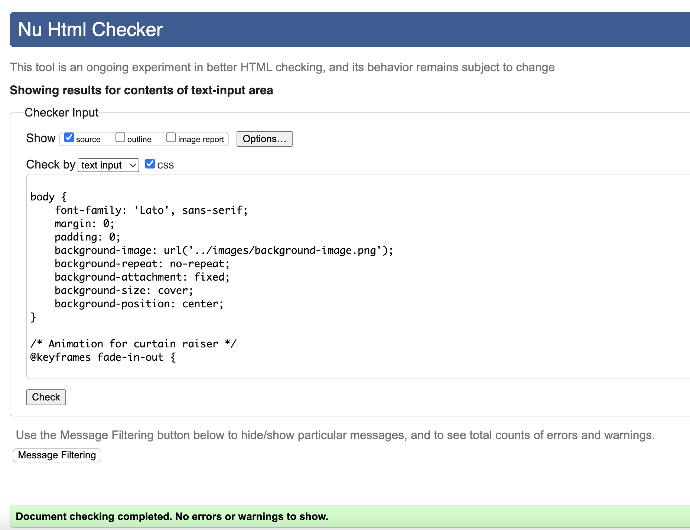.
  
- JS:
- When passing my code through the JS hint validator, I realised that, most of the arguments I passed lack closure, example the semicolons and some parentheses and also some of the camelCases weren't placed properly, by the correcting the errors and rechecking the code, no errors were returned also some buttons weren't responding, I realised I have made some errors with my event listeners, I realised i used get Elements by Class name instead of Tag names for my buttons and also I forgot to put them in an array for example [i].
after fixing them and using the right methods I passed the code again through the official  validator it showed one warning but actually everything works fine. the event listeners and the computer adaptive functions when the user clicks to choose a choice against the computer. [Jshint](https://jshint.com/) 

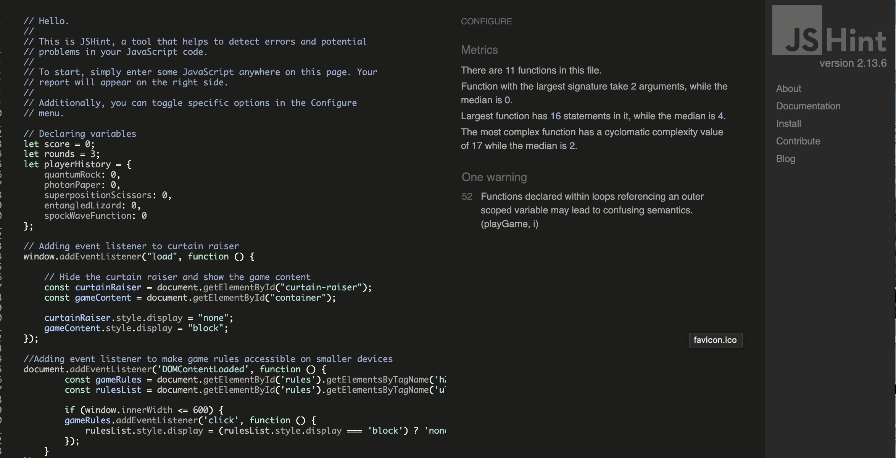
 
- Accessibility:
- I confirmed that the colors and fonts chosen are easy to read and accessible by running it through lighthouse in devtools.
- Also the media queries responded positively when i checked the responsiveness on various devices especially mobile devices, I used [responsivedesignchecker](https://responsivedesignchecker.com/) and [AmIresponsive](https://ui.dev/amiresponsive?/)

## Lighthouse tests

Lighthouse test on accessibility through the Dev-tools on google chrome for both smart devices and desktops respectively.

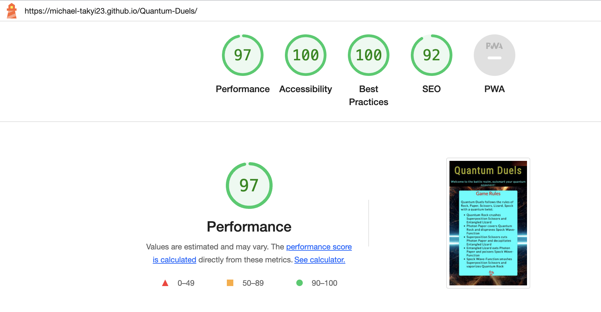
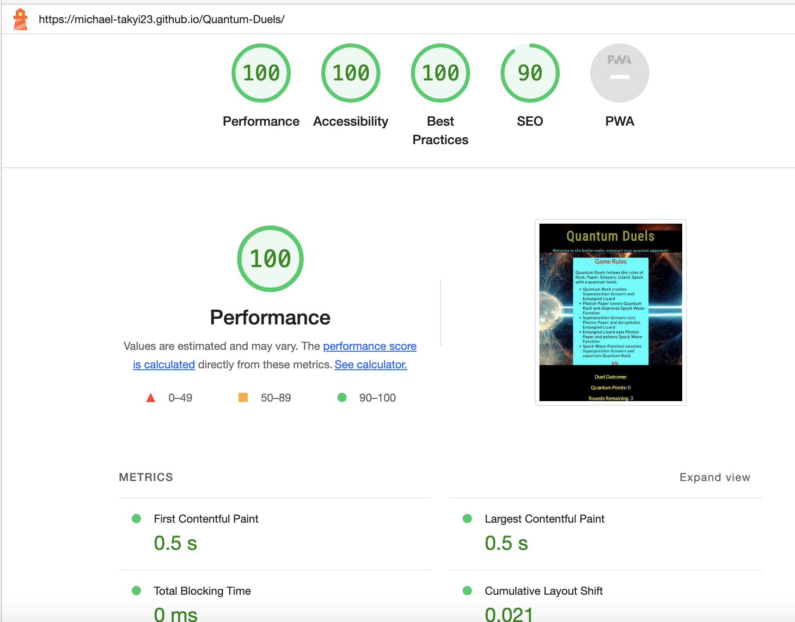

### Bugs

- Upon testing the website and playing the game it came to my notice that the user could continue playing the game and winning without running out of rounds just selecting the Superposition Scissors choice which could encourage cheating. The computer could not counter the move regardless the number of times the user selects the Superposition Scissors. Which made the game pretty boring to the user because the user could easily cheat and win as many times as they please. I figured it was how I wrote the code for the function makeAdaptiveComputerChoice

- By introducing unpredictability: 30% chance to use adaptive choice and 70% chance to make a random choice. With the use of the Math.random() method, to return the counterMove() in the makeAdaptiveComputerChoice function the bug was fixed and the computer could counter the users choices, making the game more challenging and interesting to the user.

- On desktops and smaller devices, the content of the page was not stable, I figured when i slide the content to the left there a appeared a big gap on the side of the page therefore shitting the contents to the right. I figured that some of my H1 and H2 elements were too big and shifted the other elements making them shift from their original position. by adding max.width of 50vw and margin of 20px auto; to my H1 element the bug was solved.

## Deployment

This website was deployed to Github pages. The steps to deploy are as follows:

- Log in to GitHub and locate and locate the GitHub repository. 
- At the top of the Repository (not top of page), locate the "Settings" Button on the menu.
- scroll down to find the Github pages section.
- then click on pages and locate Build and Deployment
- From the source section click the drop-down menu called "None" and select "Main Branch",
- Select save and then refresh page, scroll back down the refreshed page to get the deployed website link.

The website can be accessed from the following link - [Quantum Duels](https://michael-takyi23.github.io/Quantum-Duels/)

## Forking the GitHub Repository

By forking the GitHub Repository we make a copy of the original repository on our GitHub account to view and/or make changes without affecting the original repository by using the following steps...

- Log in to GitHub and locate the GitHub Repository
- At the top of the Repository (not top of page) just above the "Settings" Button on the menu, locate the "Fork" Button.
- You should now have a copy of the original repository in your GitHub account.

## Credits

### Contents

- The icons used on the site were sourced from [Font Awesome](https://fontawesome.com/).
- The fonts for the webpage was sourced from [Google fonts](https://fonts.google.com/).

### Media

- The images for the player and computer choice was sourced from [Akshaybahadur](https://www.akshaybahadur.com/post/rock-paper-scissors-lizard-spock).
- The background image was sourced from [Google](https://google.com/).

### Acknowledgements

- My Mentor for continuous helpful feedback.

- Thanks to CI Love Math walkthrough project, gave me the idea the build the structure for the various functions in my script.js and also creating my event listener for the button clicks.

- Thanks to CI tutor support for swift and effective response when I faced issues with my workspace on 'codeanywhere'.
